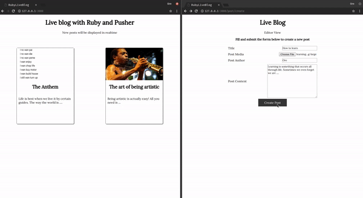

# Live Blog App with Pusher + Cloudinary + Ruby



## Getting Started
Clone The Repository
```
$ git clone https://github.com/oreHGA/ruby-live-blog.git
```

Change directory
```
$ cd ruby-live-blog
```

Install dependencies
```
$ bundle install
```

Setup up database
```
$ rails db:setup

$ rails db:migrate
```

Download Cloudinary config file [here](https://cloudinary.com/console/cloudinary.yml) and put file in the `config/` directory

Obtain Pusher credentials [here](https://dashboard.pusher.com/) and update the `config/initializers/pusher.rb` file.

Run the app
```
$ rails server
```

Prerequisites
- A basic knowledge of Ruby

Built With
- Pusher - A Ruby gem to interact with the Pusher REST API
- Cloudinary - Cloudinary is a media management platform for web and mobile developers
